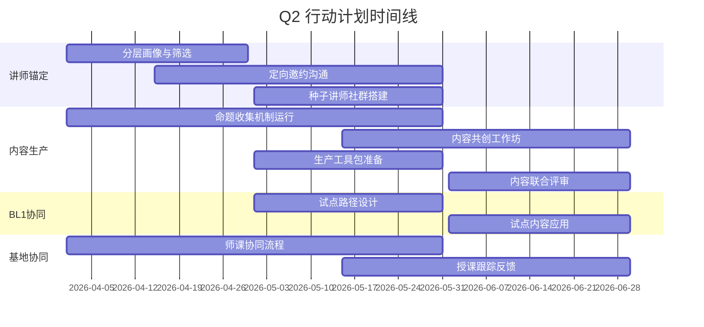

# Q2-OKR 详细行动计划

> **时间**: 2026年Q2（4-6月）  
> **主题**: 跑通内容生产路径（**讲师×AI**）

---

## O1-Q2：激活价值飞轮

---

### KR1：讲师锚定 ⭐

> **目标**: 完成核心"种子讲师"的筛选与锚定，构建不少于**3人**的核心讲师团队，并建立初步链接。

#### 行动计划

| 序号 | 动作 | 时间 | 负责人 | 产出 |
|------|------|------|--------|------|
| 1.1 | 分层讲师画像与锚定 | 4月 | 东东 | 应用"最应该+最想来+最需要"模型，初步筛选潜力讲师名单 |
| 1.2 | 定向邀约沟通 | 4-5月 | 东东 | 通过"定向邀约"方式，与至少3位讲师完成意向沟通与合作协议 |
| 1.3 | 种子讲师社群搭建 | 5月 | 东东 | 建立"种子讲师"专属微信群，完成初步运营机制搭建 |

---

### KR2：内容生产 ⭐

> **目标**: 跑通"命题收集-内容生产"关键路径，并产出优质内容不少于**3个**。

#### P1：命题评审与闭环启动

| 序号 | 动作 | 时间 | 负责人 | 产出 |
|------|------|------|--------|------|
| 2.1 | 命题收集机制运行 | 4-5月 | 燕儿姐 | 运行季度命题收集与评审机制 |
| 2.2 | 高优先级命题筛选 | 5月 | 燕儿姐 | 从年度命题池中筛选1-2个高优先级试点命题 |
| 2.3 | 内容共创工作坊 | 5-6月 | 燕儿姐 | 针对试点命题召开至少1场共创工作坊，明确内容形式与交付标准 |

#### P2：标准化生产与品控

| 序号 | 动作 | 时间 | 负责人 | 产出 |
|------|------|------|--------|------|
| 2.4 | 生产工具包准备 | 5月 | 启哥 | 为种子讲师提供"标准化生产工具包"（含AI工具、标准模板、案例库等） |
| 2.5 | 品控流程启动 | 5-6月 | 燕儿姐 | 启动"命题共识+匹配赋能+联合评审+场景应用"品控流程 |
| 2.6 | 内容联合评审 | 6月 | 燕儿姐 | 完成至少3个内容的联合评审与定稿 |

---

### KR3：BL1协同 ⭐

> **目标**: 完成至少1个TGC内容在花桥基地的试点应用，验证"内容-场景"匹配度。

#### P1：场景化试点SOP设计

| 序号 | 动作 | 时间 | 负责人 | 产出 |
|------|------|------|--------|------|
| 3.1 | 试点路径设计 | 5月 | 文莉 | 设计"基地首发+向外辐射"的试点路径 |
| 3.2 | 植入场景规划 | 5月 | 文莉 | 明确试点内容在基地的植入场景、权益与数据回收方式 |

#### P2：试点效果跟进

| 序号 | 动作 | 时间 | 负责人 | 产出 |
|------|------|------|--------|------|
| 3.3 | 试点内容应用 | 6月 | 文莉 | 在试点营次中应用TGC内容 |
| 3.4 | 一线效果调研 | 6月 | 文莉 | 完成授课效果/价值数据的一线调研 |

---

## O2-Q2：基地协同

---

### KR1：基地支持 ⭐

> **目标**: 跑通《解决方案》+《方案共创》师课协作方式，保障承接课程讲师**CSR≥4.90**。

#### 行动计划

| 序号 | 动作 | 时间 | 负责人 | 产出 |
|------|------|------|--------|------|
| 4.1 | 师课协同流程细化 | 4-5月 | 燕儿姐 | 与课研团队共同细化讲师协同流程（备课、授课、复盘） |
| 4.2 | 授课全流程跟踪 | 5-6月 | 燕儿姐 | 跟踪1-2位讲师的授课全流程，收集反馈，优化协同节点 |
| 4.3 | 讲师体验标准落实 | 5-6月 | 燕儿姐 | 落实讲师在基地的授课与生活体验标准 |
| 4.4 | 即时反馈通道建立 | 5月 | 燕儿姐 | 建立即时反馈通道，快速响应并解决讲师问题 |

---

### KR2：讲师反哺 ⭐

> **目标**: 以TGC运营为抓手，为花桥基地激活/引入讲师**≥1名**。

#### 行动计划

| 序号 | 动作 | 时间 | 负责人 | 产出 |
|------|------|------|--------|------|
| 5.1 | 历史讲师盘点 | 4月 | 东东 | 盘点历史研课共创讲师，分类建立链接 |
| 5.2 | TGC赋能激活 | 4-5月 | 东东 | 以TGC为抓手，建立讲师赋能体系，搭建讲师社群 |
| 5.3 | 外部讲师引入 | 5-6月 | 东东 | 建立外部非花桥讲师引入激励机制 |

---

## Q2里程碑看板

---

## Q2关键交付物

| 交付物 | 说明 | 截止时间 |
|--------|------|----------|
| 核心种子讲师名单 | ≥3人，含联系方式和合作意向 | 5月底 |
| 种子讲师社群 | 微信群，含运营机制 | 5月底 |
| 命题池 | "1+3N"年度核心命题 | 4月底 |
| 标准化生产工具包 | AI工具+模板+案例库 | 5月底 |
| 首批TGC内容 | ≥3个完成评审的内容 | 6月底 |
| 基地试点方案 | 含SOP和数据回收机制 | 5月底 |
| 师课协同SOP | 《解决方案》+《方案共创》 | 5月底 |

---

## Q2运营日历

| 周 | 核心任务 |
|----|----------|
| 第1-2周 | 讲师画像、命题收集启动 |
| 第3-4周 | 定向邀约、师课协同流程启动 |
| 第5-6周 | 种子讲师社群搭建、共创工作坊筹备 |
| 第7-8周 | 内容共创工作坊、生产工具包发布 |
| 第9-10周 | 内容生产、试点方案设计 |
| 第11-12周 | 内容评审、试点应用 |

---

## 关联文档

- [[2026年TGC运营OKR]] - 返回OKR总览
- [[2026-OKR-里程碑]] - 阶段里程碑
- [[2026-OKR-O1]] - O1详细拆解
- [[2026-OKR-O2]] - O2详细拆解
