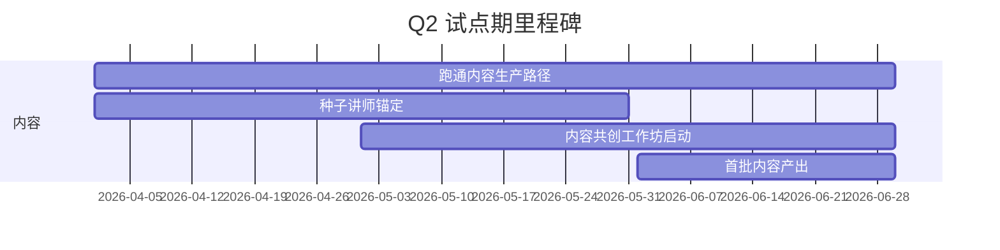
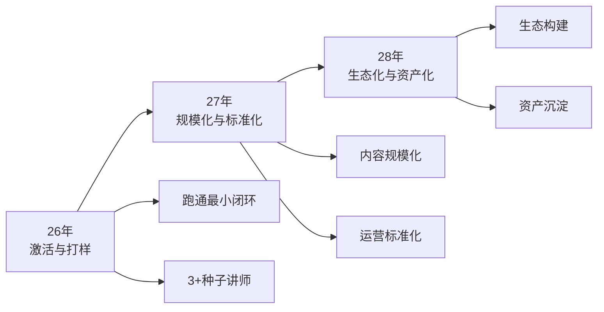

# 2026年TGC运营 阶段里程碑

> **更新时间**: 2026-05-19  
> **三年愿景**: 26年激活与打样 → 27年规模化&标准化 → 28年生态化&资产化

---

## 年度概览

| 阶段 | 时间 | 核心主题 | 关键成果 |
|------|------|----------|----------|
| **试点期** | Q2 | 跑通内容生产路径 | 3+种子讲师、3+优质内容 |
| **推广期** | Q3 | 跑通项目运营链路 | 1+场景落地、200+触达、5+种子讲师 |
| **规模期** | Q4 | 规模化生产与应用 | 10000+触达、10+签约讲师、50+内容 |

---

## Q2 试点期（26年4-6月）

### 核心目标
> 跑通内容生产路径（**讲师×AI**）

### 里程碑成果

| 指标 | 目标 |
|------|------|
| 种子讲师 | 3+ |
| 优质内容 | 3+ |
| 跑通链路 | 讲师×AI 1.0版 |

### 关键里程碑

### Q2-OKR详情

#### O1-Q2：激活价值飞轮

| KR | Q2目标 | 关键动作 |
|----|--------|----------|
| **KR1 讲师锚定** | 构建≥3人核心讲师团队 | 分层画像+定向邀约+建群运营 |
| **KR2 内容生产** | 产出≥3个优质内容 | 命题评审+共创工作坊+品控流程 |
| **KR3 BL1协同** | 1个基地试点应用 | 场景SOP设计+效果跟进 |

#### O2-Q2：基地协同

| KR | Q2目标 | 关键动作 |
|----|--------|----------|
| **KR1 基地支持** | 跑通师课协作 | 协作流程细化+1-2位讲师跟踪 |
| **KR2 讲师反哺** | 激活≥1名讲师 | 盘点+激活+引入 |

---

## Q3 推广期（26年7-9月）

### 核心目标
> 跑通项目运营链路（**运营×AI**）

### 里程碑成果

| 指标 | 目标 |
|------|------|
| 应用场景落地 | 1+ |
| 学员触达 | 200+ |
| 种子讲师 | 5+ |
| 优质内容 | 10+ |
| 标杆案例 | 1+ |
| 跑通链路 | 运营×AI 1.0版 |

---

## Q4 规模期（26年10-12月）

### 核心目标
> 规模化内容生产与场景应用

### 里程碑成果

| 指标 | 目标 |
|------|------|
| 应用场景落地 | 2+ |
| 学员触达 | 10000+ |
| 签约讲师 | 10+ |
| 内容沉淀 | 50+ |
| 标杆案例 | 3+ |
| 流量曝光 | 10000+ |

### 关键交付
- [[TGC运营手册1.0]] 产出

---

## 三年演进路径

### 各阶段特征

| 阶段 | 特征 | 核心任务 |
|------|------|----------|
| **26年** | 激活与打样 | 验证模式、打标杆、建立机制 |
| **27年** | 规模化与标准化 | 规模复制、流程标准化、团队扩张 |
| **28年** | 生态化与资产化 | 生态构建、内容资产化、品牌影响力 |

---

## 风险预警

| 阶段 | 主要风险 | 应对重点 |
|------|----------|----------|
| Q2 | 讲师参与度低、内容质量参差 | 聚焦核心城市试点，打造成功案例 |
| Q3 | 与基地产品冲突 | 建立协同机制，差异化定位 |
| Q4 | 运营资源紧缺 | 跑通AI提效路径，降本增效 |

---

## 关联文档

- [[2026年TGC运营OKR]] - 返回OKR总览
- [[2026-OKR-O1]] - O1详细拆解
- [[2026-OKR-行动计划]] - Q2详细行动计划
