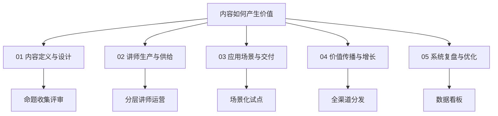
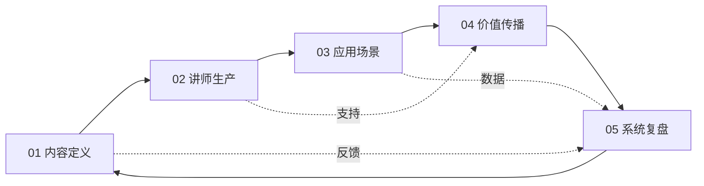

# TGC运营五大模块

> 解决"**内容如何产生价值**"的核心问题

---

## 模块总览



---

## 01 内容定义与设计

> **解决**：为什么 + 内容是什么

### 核心任务

| 任务 | 说明 |
|------|------|
| **命题收集** | 一线调研 + 季度/品质线报告 + 调研 + 渠道需求 |
| **命题评审** | "微"命题筛选 + 建立"1+3N"年度核心命题池 |
| **共创工作坊** | 业务+课研+运营+渠道专家参与 |

### 命题来源矩阵

| 大方向 | "以消费者为中心" 战略内容 |
|--------|--------------------------|
| **底层模块** | AI / 业务 / 经营 / 团队管理 / 领导力 / 文化 |

### BL1学员画像示例

| 学员画像 | 10+规模门店店东 |
|----------|-----------------|

### "微"命题示例

| 模块 | 命题示例 |
|------|----------|
| AI | 如何用AI做一份业主家庭资产配置方案？ |
| 业务 | 如何具备向客户讲清房子价值、板块逻辑的能力？ |
| 经营 | 门店如何作为"社区服务站"与居民建立长期信任？ |
| 管理 | 团队如何从放养型管理走向赋能型管理方式？ |
| 文化 | 如何避免经纪人因业绩压力忽视长期客户关系建设？ |

---

## 02 讲师生产与供给

> **解决**：谁来生产 + 怎么做出来

### 核心任务

| 任务 | 说明 |
|------|------|
| **分层讲师运营** | 最应该+最想来+最需要 / 定向邀约+规模招募 |
| **标准化工具包** | AI提效 + 标准模板 + 案例库 |
| **品控流程** | 命题共识 → 匹配&赋能 → 联合评审 → 场景植入 |

### 讲师画像模型

```
┌─────────────────────────────────────────────────────────────┐
│                     讲师画像三角模型                          │
│                                                             │
│              ┌─────────────────┐                            │
│              │   最应该来       │  变革关键人（大S等）         │
│              │   定向邀约       │                            │
│              └────────┬────────┘                            │
│                       │                                      │
│        ┌──────────────┼──────────────┐                      │
│        ↓              ↓              ↓                      │
│ ┌──────────────┐ ┌──────────────┐ ┌──────────────┐          │
│ │   最想来      │ │   核心讲师    │ │   最需要来    │          │
│ │   规模招募    │ │   主力产出    │ │   定向邀约    │          │
│ └──────────────┘ └──────────────┘ └──────────────┘          │
│                                                             │
│ 收入稳定 | 省心省力 | 专业孵化 | 赋能提效 | 讲师圈层         │
└─────────────────────────────────────────────────────────────┘
```

### 激励体系（ITMSD序列）

| 序列 | I | T | M | S | D |
|------|---|---|---|---|---|
| **规模要求** | 形式①×100 | 形式①×200 | 形式①×300 | 形式①×500 | 形式①×1000 |
| **质量要求** | ×3 | ×10 | ×20 | ×50 | ×100 |

---

## 03 应用场景与交付

> **解决**：内容怎么用 + 效果如何

### 核心任务

| 任务 | 说明 |
|------|------|
| **场景化试点SOP** | 基地首发 + 向外辐射 |
| **一线效果跟进** | TGC内容应用指南 + 授课效果调研 |

### 应用场景矩阵

| 形式 | 说明 | 应用场景 |
|------|------|----------|
| 形式① 短文/小视频 | 轻内容 | 课程案例、实践阅读材料、知识库素材 |
| 形式② 微课 | 中内容 | 线上/线下微课、知识市集、专题分享会 |
| 形式③ 系列主题 | 重内容 | 系列视频课、校友会活动、城市公开课 |

### 运营流程

```
命题共识（TGC&BL1）
       ↓
匹配&赋能（TGC/工作坊）
       ↓
联合评审（TGC&BL1）
       ↓
场景植入（BL1）
```

---

## 04 价值传播与增长

> **解决**：如何让更多人知道和参与

### 核心任务

| 任务 | 说明 |
|------|------|
| **全渠道分发矩阵** | 花桥公众号 + 讲师群 + 学员群 + 朋友圈 |
| **TGC品牌化运营** | 讲师IP + 标杆案例包装 |

### 全渠道分发矩阵

| 渠道类型 | 渠道名称 | 负责人 | 内容形式 |
|----------|----------|--------|----------|
| 核心渠道 | 花桥学堂公众号 | 文莉 | 长文推文 |
| 运营渠道 | 讲师共创群 | 东东 | 短内容 |
| 学员渠道 | 学员群 | 燕儿姐 | 案例分享 |
| 内部渠道 | 内部朋友圈 | 启哥 | 轻内容 |

### TGC品牌化运营

**讲师IP运营**
- 讲师分级分类
- "明星讲师"评估标准（星探、五维画像）
- 讲师评估智能化（AI报告）

**标杆案例品牌化**
- "TGC金牌案例"包装
- "改变案例"宣传

---

## 05 系统复盘与优化

> **解决**：如何越做越好

### 核心任务

| 任务 | 说明 |
|------|------|
| **数据看板与月度复盘** | TGC运营数据看板 + 月度复盘会 |
| **运营SOP迭代** | 五大模块SOP持续迭代 |
| **知识库沉淀** | 案例/工具包/讲师内容等 |

### TGC运营数据看板

| 数据维度 | 指标 |
|----------|------|
| 命题 | 命题数量、质量评分 |
| 生产 | 内容产出数量、按时交付率 |
| 交付 | 授课CSR、应用场景数 |
| 传播 | 曝光量、互动量 |

---

## 模块关联图



---

## 关联文档

- [[2026年TGC运营OKR]] - 返回OKR总览
- [[2026-OKR-O1]] - O1详细拆解
- [[TGC运营规划]] - 完整运营规划
